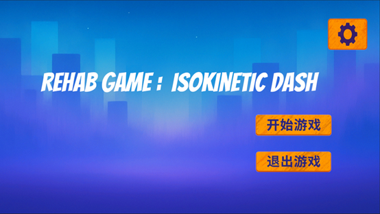
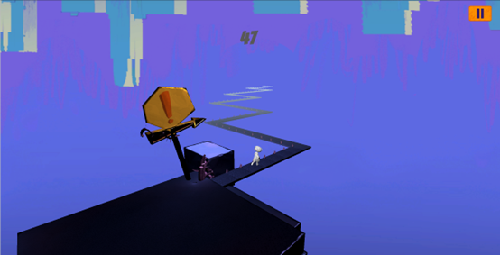
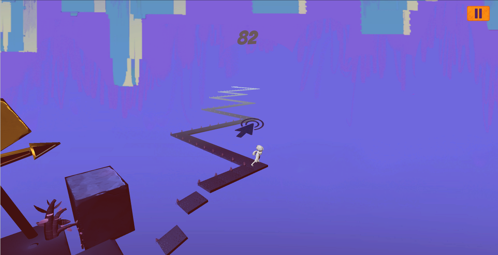

# Isokinetic Dash

Unity 3D 康复跑酷游戏原型，完整项目名为 `Isokinetic Dash`。本项目面向中风患者的腕关节等速康复训练设计，尝试把康复动作映射到更直观、更有反馈感的跑酷闯关流程中，让训练过程更容易理解与坚持。



## 下载试玩

- Windows 可执行版本：[IsokineticDash-Windows.zip](https://github.com/painfulmoments/isokinetic/releases/latest/download/IsokineticDash-Windows.zip)

## 项目定位

- 面向人群：中风患者腕关节康复训练用户
- 项目类型：Unity 3D 康复跑酷游戏 / 康复训练交互原型
- 核心目标：把等速康复训练与轻量跑酷玩法结合起来
- 主要场景：`Assets/Scenes/Start.unity`、`Assets/Scenes/SampleScene.unity`
- 目标平台：`Windows`

## 操作说明

- 鼠标右键：奔跑 / 持续前进
- 鼠标左键：转向
- `Esc`：暂停或恢复游戏

说明：
在当前项目实现里，角色的主玩法输入以鼠标为主。右键控制前进，左键在转向判定或慢动作提示出现时执行转向。

## 运行要求

- `Unity Hub`
- `Unity 2022.3.52f1c1`
- `URP 14.0.11`
- `Windows` 开发或运行环境

如果需要联调康复硬件链路，还需要额外准备：

- `PEAK PCAN` 驱动与运行库
- 编码器 / CAN 相关外部硬件
- 可选的 `Qt + UDP` 联调程序
- 可选的 `MySQL` 数据库环境

## 宣传图片

主页图：


游戏画面：





结算与失败界面：


## 项目亮点

- 以康复训练为目标，而不是单纯的休闲跑酷
- 使用转角、慢动作提示和节奏反馈强化训练动作完成感
- 保留外部设备联调能力，便于继续接入康复系统
- 已包含主菜单、暂停、胜利、失败、自动重开等完整基础流程

## 项目结构

```text
isokinetic/
├─ Assets/
│  ├─ Plugins/                  # 第三方 DLL，例如 MathNet、MySql.Data
│  ├─ Resources/
│  │  ├─ Materials/
│  │  ├─ Player/
│  │  ├─ Prefabs/
│  │  ├─ TMP fonts/
│  │  └─ uiANDbackground/
│  ├─ Scenes/
│  │  ├─ Start.unity
│  │  └─ SampleScene.unity
│  ├─ Scripts/
│  │  ├─ Entity/
│  │  ├─ QtMysqlUDP/
│  │  ├─ ScriptsUDP/
│  │  └─ *.cs
│  └─ Sounds/
├─ config/
│  └─ config.ini
├─ docs/
│  ├─ images/
│  └─ PROJECT_GUIDE.md
├─ Packages/
└─ ProjectSettings/
```

## 关键系统

- `BallMovementController`：角色移动、转向、胜负与重开
- `GroundSpawnController`：道路地块生成与补块
- `CornerTrigger`：转角触发与慢动作时机
- `SlowMotionUI`：转向提示 UI
- `PauseController`：暂停与返回主菜单
- `ReadConfig`：读取 `config/config.ini`
- `EncoderManager`：编码器 / CAN 数据读取与角度映射

## 快速开始

1. 使用 `Unity Hub` 打开项目根目录。
2. 选择 `Unity 2022.3.52f1c1` 打开工程。
3. 检查 `config/config.ini`，按本机环境调整设备、UDP、数据库参数。
4. 打开 `Assets/Scenes/Start.unity`。
5. 点击 Unity 编辑器中的 `Play` 进入游戏。

## 当前状态说明

- 当前可直接验证的主玩法控制方式是鼠标操作
- 项目中保留了康复硬件与编码器读取模块
- 若要完整跑通硬件联调，需要补齐设备、驱动和外部程序环境

## 详细项目指南

更完整的项目结构分析、脚本职责说明、外设链路和接手建议见：

- [docs/PROJECT_GUIDE.md](docs/PROJECT_GUIDE.md)
