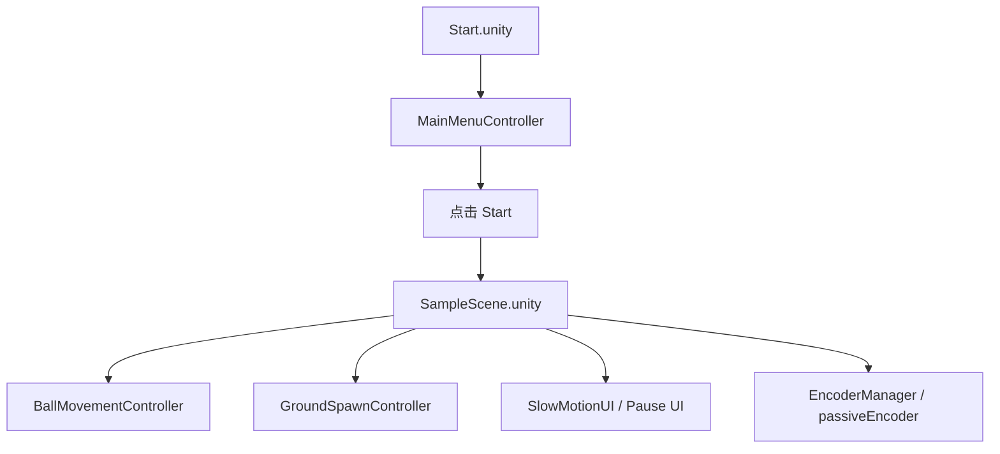

# Isokinetic Dash 项目指南

`Isokinetic Dash` 是这款 Unity 3D 康复跑酷游戏的完整项目名。本文档基于仓库当前内容整理，目标是帮助新接手这个项目的人快速回答三个问题：

1. 这个项目现在到底做到了什么。
2. 运行它需要哪些 Unity、硬件和联调前置条件。
3. 后续继续开发时，应该优先看哪些脚本、场景和配置。

## 1. 项目定位

`isokinetic` 仓库承载的是 `Isokinetic Dash` 这个以康复训练为背景的 Unity 原型项目。现有实现把以下几层内容叠在一起：

- 一个轻量跑酷/路径挑战玩法
- 慢动作转向的交互反馈
- 腕关节康复设备姿态输入
- 本地日志与配置读取
- 可选的 UDP 与 MySQL 联调能力

从脚本命名、配置项和角度注释来看，这个项目重点围绕腕关节三轴动作：

- 屈伸
- 桡偏 / 尺偏
- 旋前 / 旋后

这些动作参数在 `config/config.ini` 里有明确的角度范围和设备标定信息。

## 2. 技术栈与依赖

### Unity 与包依赖

- Unity：`2022.3.52f1c1`
- Render Pipeline：`Universal Render Pipeline 14.0.11`
- UI：`UGUI` + `TextMeshPro`
- 其他包：`Timeline`、`VisualScripting`

### 第三方 DLL

仓库内已经包含：

- `Assets/Plugins/MathNet.Numerics.dll`
- `Assets/Plugins/MySql.Data.dll`

仓库内没有直接包含，但代码明确依赖：

- `PCANBasic.dll`

这一点来自 `Assets/Scripts/ScriptsUDP/PCANBasic.cs` 中的大量 `DllImport("PCANBasic.dll")` 声明。也就是说，如果你要启用硬件编码器/CAN 功能，运行环境必须先装好 PEAK PCAN 相关驱动和运行库。

### 运行平台假设

这个项目明显是 Windows 优先，原因包括：

- 依赖 `PCANBasic.dll`
- 配置了本地 ODBC / MySQL 风格连接
- 联调对象带有 `Qt` UDP 服务端假设

## 3. 仓库结构说明

```text
isokinetic/
├─ Assets/
│  ├─ Plugins/                 # 数值计算和数据库 DLL
│  ├─ Resources/
│  │  ├─ Materials/            # 材质、URP 资源
│  │  ├─ Player/               # 角色模型与动画
│  │  ├─ Prefabs/              # 地块、触发器、UI 等预制体
│  │  ├─ TMP fonts/            # 字体资源
│  │  └─ uiANDbackground/      # 背景与贴图资源
│  ├─ Scenes/
│  │  ├─ Start.unity
│  │  └─ SampleScene.unity
│  ├─ Scripts/
│  │  ├─ Entity/
│  │  ├─ QtMysqlUDP/
│  │  ├─ ScriptsUDP/
│  │  └─ 玩法与 UI 脚本
│  └─ Sounds/
├─ config/
│  └─ config.ini
├─ Packages/
├─ ProjectSettings/
└─ README.md
```

### 目录分工

`Assets/Scripts` 可以大致分为四组：

- 玩法与场景控制
- UI 与菜单
- 配置 / 日志 / 联调
- 编码器 / CAN / 样例通信

这四组之间的边界并不是完全干净，说明项目还处于原型阶段，后续整理空间很大。

## 4. 场景结构与运行流程

### 4.1 场景列表

Build Settings 里启用的场景只有两个：

- `Assets/Scenes/Start.unity`
- `Assets/Scenes/SampleScene.unity`

### 4.2 Start 场景职责

从场景根对象名称可以看出，`Start.unity` 主要负责初始化：

- `Encoder`
- `EventSystemManager`
- `Main Camera`
- `Log`
- `Config`
- `GameManager`

这意味着主菜单不是一个纯 UI 空壳，它同时承担了多种全局单例的启动职责。

### 4.3 SampleScene 场景职责

`SampleScene.unity` 里可以看到这些关键对象：

- `Main Ground`
- `Ground Spawner`
- `BackGround`
- `Main Camera`
- `Encoder2`
- 多个按钮与 TMP 文本对象

这说明核心训练场景由“地块生成 + 角色移动 + UI + 编码器物体”共同构成。

### 4.4 场景切换流程



## 5. 核心玩法系统

### 5.1 主菜单系统

主菜单核心脚本是 `Assets/Scripts/MainMenuController.cs`。

它负责：

- 创建或复用常驻 `BgmPlayer`
- 根据当前场景切换菜单 BGM 与游戏 BGM
- 点击开始时调用 `GameManager.o.GameStart()`
- 切换到 `SampleScene`
- 打开设置面板
- 退出游戏

这套实现说明：

- BGM 被设计成跨场景持久对象
- `GameManager` 被当作全局状态入口

### 5.2 游戏状态管理

`Assets/Scripts/GameManager.cs` 是一个简化后的全局单例。

它目前提供：

- `GameReady()`
- `GameStart()`
- `GamePause()`
- `GameContinue()`
- `GameEnd()`
- `SaveDate()`

同时还定义了一批结果与动作数据结构：

- `Result`
- `RotateDate`
- `ActionDate`
- `HandDate`
- `TestDate`

这些结构表明项目原本或计划中需要记录：

- 主动/被动训练数据
- 左右手数据
- 多动作维度的角度采样

但当前版本里，`GameManager` 的部分旧逻辑被注释掉了，`SaveDate()` 也只做了日志与退出，说明完整的数据存储流程尚未完成。

### 5.3 角色移动与计分

核心脚本：`Assets/Scripts/BallMovementController.cs`

它控制了整个训练场景的主循环：

- 读取方向
- 根据输入决定是否移动
- 更新角色位置与朝向
- 计算移动距离并转成分数
- 达到阈值后胜利
- 触发自动重开或返回主菜单

#### 输入规则

- 按住鼠标右键：持续前进
- 普通状态左键：停止移动
- 慢动作决策状态左键：执行转向

#### 分数规则

- 通过位移累积分数
- 使用 `scoreMultiplier` 做换算
- 达到 `winScore` 后触发胜利面板

#### 节奏设计

- 初始方向默认向前
- 角色沿当前方向移动
- 到达一定位置阈值后提升移动速度
- 地块转角处进入慢动作窗口

#### 额外机制

- 胜利后暂停时间
- 自动倒计时重开场景
- 也支持手动返回主菜单

### 5.4 慢动作转向系统

这部分由两支脚本共同完成：

- `Assets/Scripts/CornerTrigger.cs`
- `Assets/Scripts/SlowMotionUI.cs`

流程如下：

1. 球体进入转角触发器。
2. 游戏时间缩放降低。
3. 显示慢动作提示 UI。
4. `BallMovementController` 进入等待转向状态。
5. 玩家左键确认后完成转向。
6. UI 隐藏，时间恢复正常。

这套系统是当前玩法体验里最有特色的部分，也是 README 中最值得重点介绍的机制。

### 5.5 地块生成与回收

核心脚本：

- `Assets/Scripts/GroundSpawnController.cs`
- `Assets/Scripts/GroundCollisionController.cs`
- `Assets/Scripts/GroundFallController.cs`
- `Assets/Scripts/GroundPositionController.cs`

#### 生成逻辑

- 开局直接生成 100 块地面
- 默认方向在“前进”和“左转”之间切换
- 满足最短直线路段后，按概率生成转角

#### 生命周期

- 球体离开地块碰撞后，地块被标记为下落
- 延迟开启重力
- 当地块掉到设定高度以下时销毁
- 生成器检测剩余数量，低于阈值后补充新地块

这说明地块系统采用的是“伪对象池式续生成”，不是完整对象池，但已经能满足原型场景的连续生成需求。

### 5.6 摄像机、背景与表现层

相关脚本：

- `Assets/Scripts/CameraFollowController.cs`
- `Assets/Scripts/BackGround.cs`
- `Assets/Scripts/GroundColorController.cs`

职责分别是：

- 相机平滑跟随球体
- 背景材质随前进距离滚动，形成视差
- 地面材质在若干颜色之间插值切换

这些内容共同撑起了训练场景的基本视觉反馈。

## 6. UI 与交互系统

### 6.1 暂停系统

`Assets/Scripts/PauseController.cs` 负责：

- `Esc` 开关暂停
- 显示/隐藏暂停面板
- 通知 `GameManager` 改变状态
- 从暂停界面返回主菜单

### 6.2 设置系统

`Assets/Scripts/SettingsController.cs` 负责：

- 读取并保存音量设置
- 同步 `AudioMixer` 与 `AudioListener`
- 使用 `PlayerPrefs` 记住 `MasterVolume`

### 6.3 EventSystem 持久化

`Assets/Scripts/PersistentEventSystem.cs` 会保证场景切换后只有一个 `EventSystem` 存在，避免重复实例导致 UI 输入混乱。

## 7. 配置、日志与联调系统

### 7.1 配置读取

核心脚本：`Assets/Scripts/QtMysqlUDP/ReadConfig.cs`

它会在启动时读取 `config/config.ini`，并将下列参数缓存为全局可访问字段：

- 数据库地址、端口、用户名、密码
- 设备型号与零位
- 传动比和精度
- 动作角度边界
- UDP IP 与端口
- 若干训练时长参数

### 7.2 日志系统

核心脚本：

- `Assets/Scripts/QtMysqlUDP/ZLog.cs`
- `Assets/Scripts/QtMysqlUDP/FileLogger.cs`

特点：

- 监听 Unity 的日志输出
- 将非 Warning 日志写入本地文件
- 默认输出到 `logUnity/`
- 按日期滚动
- 默认保留 30 天

如果你在排查联调问题，这个日志目录会很有用。

### 7.3 UDP 联调

核心脚本：`Assets/Scripts/QtMysqlUDP/UdpClientHandler.cs`

作用：

- 用配置文件里的 IP/端口初始化 Socket
- 向 Qt 端发送握手字符串
- 后台线程接收 UDP 数据

注意点：

- 代码使用线程 + 原始 Socket
- 退出时调用了 `Thread.Abort()`，后续最好改造为更安全的关闭逻辑

### 7.4 MySQL 联调

核心脚本：`Assets/Scripts/QtMysqlUDP/SqlAccess.cs`

它封装了：

- 数据库连接与关闭
- 患者手部侧别查询
- 训练记录表 `t_02_002` 的增删改查
- 评估相关表 `t_03_002`、`t_03_003` 的写入更新

配套数据对象位于：

- `Assets/Scripts/Entity/T_table.cs`
- `Assets/Scripts/Entity/T1_table.cs`
- `Assets/Scripts/Entity/GameSettings.cs`

## 8. 编码器与硬件输入系统

### 8.1 核心文件

- `Assets/Scripts/ScriptsUDP/EncoderManager.cs`
- `Assets/Scripts/ScriptsUDP/passiveEncoder.cs`
- `Assets/Scripts/ScriptsUDP/PCANBasic.cs`

### 8.2 代码用途

从代码内容看，这套系统负责：

- 初始化 PEAK PCAN 通道
- 读取编码器数据
- 根据设备零位与传动比做换算
- 计算姿态角
- 把结果映射回 Unity 中的三轴旋转

### 8.3 和康复动作的关系

在 `config/config.ini` 中可以看到对动作范围的定义：

- `xLeft / xRight`
- `yUp / yDown`
- `zLeft / zRight`

注释还直接指向：

- 伸展 / 屈曲
- 桡侧偏 / 尺侧偏
- 旋后 / 旋前

这与项目“等速康复”定位是对得上的。

### 8.4 其他 ScriptsUDP 文件的定位

`Assets/Scripts/ScriptsUDP` 里还有一批文件：

- `01_LookUpChannel.cs`
- `03_ManualRead.cs`
- `04_ManualWrite.cs`
- `Packet.cs`
- `PlayerManager.cs`
- `ThreadManager.cs`

它们更像是以下两类内容的混合：

- PEAK 官方/半官方示例代码
- 早期网络同步或实验性联调代码

在当前 README 和接手说明里，建议把这个目录明确标成“硬件与样例脚本区”，避免新同学误以为所有脚本都是现在线上主流程的一部分。

## 9. 资源与美术组织

### 9.1 角色与动画

`Assets/Resources/Player/` 下包含：

- 角色模型 FBX
- 动作 FBX
- 动画控制器

这意味着当前角色表现依赖导入模型和 Animator，而不是程序生成。

### 9.2 预制体

`Assets/Resources/Prefabs/` 下包含：

- 地块
- 触发器
- 画布
- 暂停面板

这些资源是场景搭建和功能脚本的主要载体。

### 9.3 UI 和字体

项目用了：

- TextMesh Pro 默认资源
- 自定义 TMP 字体
- 背景与 UI PNG 资源

### 9.4 音频

`Assets/Sounds/` 下已经包含：

- BGM 音乐文件
- `MasterMixer.mixer`

音频控制逻辑与设置面板已接通。

## 10. 本地运行与联调建议

### 10.1 最小可运行路径

如果你只是想先确认玩法闭环：

1. 用 Unity 2022.3.52f1c1 打开项目。
2. 检查 `Start.unity` 和 `SampleScene.unity` 是否都能正常加载。
3. 先不接外部服务，重点验证主菜单、暂停、转向、得分和胜利重开。

### 10.2 硬件联调路径

如果你要接编码器设备：

1. 安装 `PCANBasic.dll` 对应驱动和运行库。
2. 确认设备接入的是 `PCAN_USBBUS1` 或调整代码。
3. 根据设备型号修改 `config/config.ini` 中的零位、传动比和精度。
4. 在 Unity 中观察三轴旋转是否和设备动作匹配。

### 10.3 数据联调路径

如果你要联调 Qt 和 MySQL：

1. 修改 `config/config.ini` 中的 IP、端口和数据库连接。
2. 启动 Qt UDP 对端程序。
3. 准备本地测试数据库。
4. 检查 Unity 日志与 `logUnity/` 文件确认连通状态。

## 11. 风险点与技术债

这个仓库的文档补充里，建议明确写出以下现状，因为它们会直接影响接手成本。

### 11.1 配置与敏感信息直接入库

数据库连接信息目前直接放在 `config/config.ini`。这对于原型方便，但不适合长期维护。

建议后续至少做到：

- 提交示例配置文件
- 本地敏感配置不入库
- 使用环境区分开发/测试/正式参数

### 11.2 单例较多、职责边界偏松

以下对象都是单例或准单例风格：

- `GameManager`
- `ReadConfig`
- `SlowMotionUI`
- `PlayerDeath`
- `EncoderManager`

这让原型开发很快，但会增加场景耦合和调试成本。

### 11.3 游戏逻辑与康复/联调逻辑耦合

当前项目把玩法、硬件输入、日志、数据库、UDP 都放在一个 Unity 客户端里，优点是联调整体性强，缺点是：

- 一处联调故障会影响玩法验证
- 纯玩法迭代时也要背外设依赖
- 新人上手成本偏高

### 11.4 存在历史迁移痕迹

`GameManager.cs` 里有不少“原有逻辑已注释”的代码，说明项目经历过一次结构删改，但没有完全收口。后续整理时，最好明确哪些是弃用流程，哪些是暂存 TODO。

### 11.5 样例脚本与正式逻辑混在一起

`ScriptsUDP` 目录下既有正式编码器管理脚本，也有示例程序和网络实验代码。建议后续拆分：

- `Hardware/`
- `Hardware/Samples/`
- `Networking/Experimental/`

## 12. 建议的阅读顺序

如果你是第一次接手，建议按下面顺序看：

1. `README.md`
2. `Assets/Scripts/MainMenuController.cs`
3. `Assets/Scripts/GameManager.cs`
4. `Assets/Scripts/BallMovementController.cs`
5. `Assets/Scripts/GroundSpawnController.cs`
6. `Assets/Scripts/CornerTrigger.cs`
7. `Assets/Scripts/SlowMotionUI.cs`
8. `Assets/Scripts/QtMysqlUDP/ReadConfig.cs`
9. `Assets/Scripts/ScriptsUDP/EncoderManager.cs`
10. `config/config.ini`

这个顺序基本对应“先懂玩法，再懂外设，再懂联调”。

## 13. 后续开发建议

### 13.1 如果目标是先让玩法更稳

优先建议：

- 给主流程补场景说明和对象命名规范
- 清理不用的旧脚本与注释逻辑
- 把转向、得分、胜利这条链路拆成更清晰的模块
- 增加最基础的运行说明和故障排查文档

### 13.2 如果目标是先让硬件联调更稳

优先建议：

- 明确 `PCANBasic.dll` 的安装要求
- 把设备初始化失败时的报错做得更可读
- 给 `config.ini` 添加示例值和字段说明
- 避免直接在主流程里依赖不可用的外设

### 13.3 如果目标是可持续维护

优先建议：

- 拆分样例脚本与正式脚本
- 把数据库配置改成外部安全配置
- 增加基础测试清单
- 梳理“主动训练”和“被动训练”模式到底由哪些脚本负责

## 14. 结论

当前仓库已经具备一个可继续迭代的原型基础：

- Unity 场景和玩法闭环已经搭起来了
- 硬件输入与数据联调接口已经放进项目
- 美术、UI、BGM 和日志也有基础实现

但它仍然明显处在“研发原型”阶段，而不是“整理完成的产品工程”阶段。  
对于后续接手者来说，最重要的不是先加功能，而是先把以下三件事补齐：

- 文档
- 依赖说明
- 正式逻辑与样例代码的边界

这也是为什么本仓库优先需要完整 README 和项目指南。

## 15. 致谢

- 美术特别感谢：韩雨禾
- 建模特别感谢：鞠一鸣
